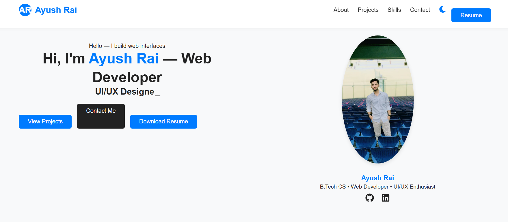
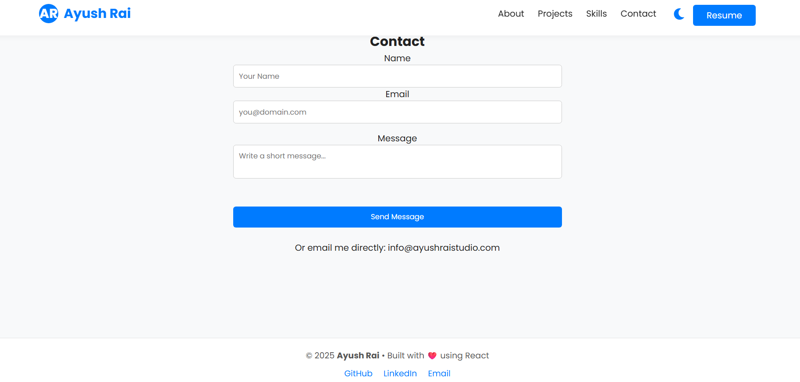

<div align="center">

  # 👨‍💻 Ayush Rai | Portfolio Website

  [](https://reactjs.org/)
  [](https://www.netlify.com/)
  [](LICENSE)

  <p>
    A personal portfolio website built with <strong>React</strong> to showcase my skills, projects, and professional journey.  
    Designed with a focus on <strong>UI/UX</strong>, responsiveness, and clean code.
  </p>

  <h3>
    <a href="https://ayushraistudio.com">🔴 View Live Website</a>
  </h3>
</div>

---

## 📸 Screenshots

> **Note:** Screenshots are arranged in a grid for a cleaner view.

| **🏠 Home Page** | **🌙 Dark Mode** |
| :---: | :---: |
|  |  |

| **📂 Projects Section** | **📩 Contact Section** |
| :---: | :---: |
|  |  |

---

## 📌 Purpose of the Project

* **Personal Branding:** Establishing a strong online presence.
* **Showcase Work:** A centralized hub for my web development projects and designs.
* **Networking:** Making it easy for recruiters and clients to connect with me.
* **Deployment:** Demonstrating proficiency in deploying React apps on custom domains.

---

## 🛠 Tech Stack

| Category | Technologies |
| :--- | :--- |
| **Frontend** | React.js, HTML5, CSS3, JavaScript (ES6+) |
| **Animations** | Typewriter Effect, CSS Animations |
| **Tools** | npm, Git, VS Code |
| **Services** | EmailJS (Contact Form), Netlify (Hosting) |

---

## ✨ Key Features

✅ **Fully Responsive:** Optimized for Mobile, Tablet, and Desktop.  
✅ **Dark Mode Toggle:** Seamless switch between Light and Dark themes.  
✅ **Dynamic Content:** Typewriter effects and interactive hover states.  
✅ **Project Showcase:** Detailed cards for each project with links.  
✅ **Contact Form:** Functional email system powered by **EmailJS**.  
✅ **Performance:** Fast-loading Single Page Application (SPA).

---

## 🚀 How to Run Locally

If you want to run this project on your local machine, follow these steps:

1.  **Clone the Repository**
    ```bash
    git clone [https://github.com/ayushraistudio/ayushstudio.git](https://github.com/ayushraistudio/ayushstudio.git)
    ```

2.  **Navigate to the folder**
    ```bash
    cd ayushstudio
    ```

3.  **Install Dependencies**
    ```bash
    npm install
    ```

4.  **Start the Development Server**
    ```bash
    npm start
    ```

   The app will open automatically at `http://localhost:3000`.

---

## 📄 License

This project is open-source and licensed under the **MIT License**.  
Feel free to use the code for learning or building your own portfolio!

---

<div align="center">
  <h3>Made with ❤️ by Ayush Rai</h3>
  <p>
    <a href="https://github.com/ayushraistudio">GitHub</a> • 
    <a href="https://ayushraistudio.com">Website</a>
  </p>
</div>

